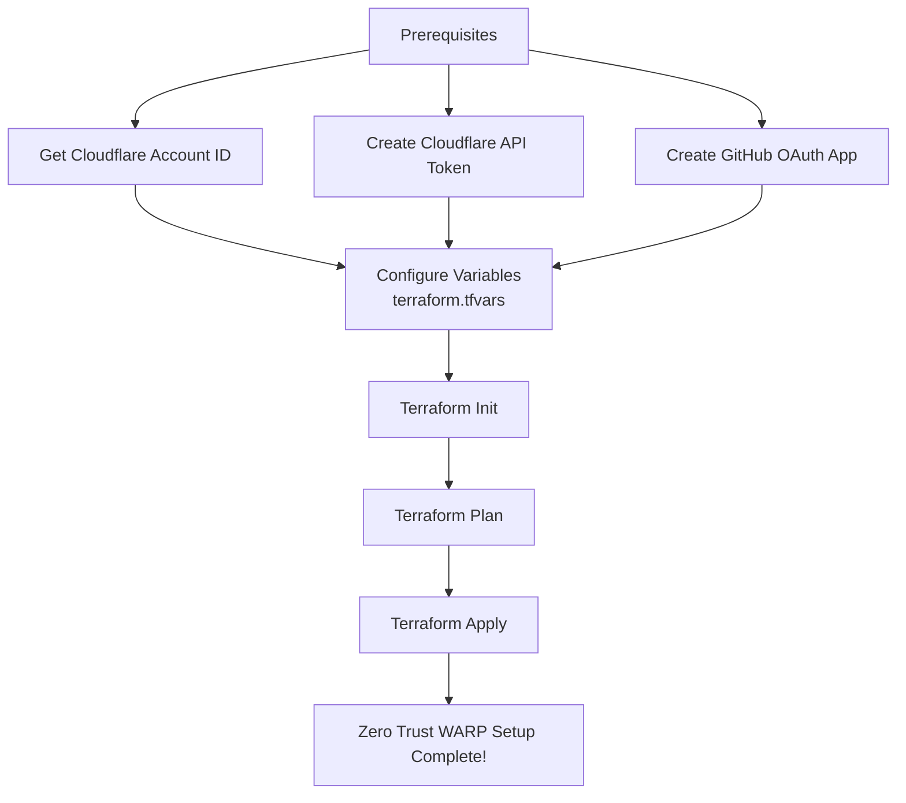

# terraform-cloudflare-zero-trust-warp

This Terraform project provisions a Cloudflare Zero Trust WARP configuration with GitHub authentication.

## What is Cloudflare Zero Trust?
Cloudflare Zero Trust is a security framework that requires all users, devices, and applications to be authenticated and authorized before accessing your network or resources. It shifts the security perimeter from the traditional network edge to individual users and devices, ensuring secure access from anywhere.

## What is WARP?
WARP is Cloudflare's VPN-like service that encrypts your device's internet traffic and routes it through Cloudflare's global network. It provides faster, more secure internet access, and when used with Cloudflare Zero Trust, allows you to enforce device posture checks and secure access to your private resources.

## Architecture & Setup Flow



## Prerequisites

1. **Terraform**: [https://developer.hashicorp.com/terraform/downloads](https://developer.hashicorp.com/terraform/downloads)
2. **Cloudflare Account**: You need a Cloudflare account with access to Zero Trust
3. **GitHub OAuth App**: Create a GitHub OAuth app for authentication

## Complete Setup Guide

### Step 1: Get Cloudflare Account ID

#### Option A — From the dashboard URL
1. Log in to the Cloudflare dashboard
2. Select any domain/account from your home page
3. Look at the URL — it will be in the form: `https://dash.cloudflare.com/<ACCOUNT_ID>/...`
4. Copy the `<ACCOUNT_ID>` segment

#### Option B — From the Account home page
1. Log in to the Cloudflare dashboard
2. Click Workers & Pages (or any domain overview)
3. On the right sidebar, find Account ID and click the copy icon

#### Option C — Via the API
```bash
curl -X GET "https://api.cloudflare.com/client/v4/accounts" \
  -H "Authorization: Bearer <YOUR_API_TOKEN>" \
  -H "Content-Type: application/json"
```
The `result[].id` field in the JSON response is your Account ID.

### Step 2: Create Cloudflare API Token
1. Go to **Cloudflare Dashboard → My Profile → API Tokens**
2. Click **"Create Token"**
3. Use the **"Create Custom Token"** option
4. Add the following permissions:
   - **Account → Cloudflare Access → Edit**
   - **Account → Zero Trust → Edit**
5. Under **"Account Resources"**, select your account
6. Click **"Continue to summary"**, then **"Create Token"**
7. Save the generated token securely

### Step 3: Create GitHub OAuth App
1. Go to **GitHub → Settings → Developer settings → OAuth Apps**
2. Click **"New OAuth App"**
3. Fill in the form:
   - **Application name**: Cloudflare Zero Trust
   - **Homepage URL**: `https://<your-auth-domain>.cloudflareaccess.com`
   - **Authorization callback URL**: `https://<your-auth-domain>.cloudflareaccess.com/cdn-cgi/access/callback`
4. Click **"Register application"**
5. Save the **Client ID** and generate a **Client Secret** (save this securely too)

## Setup & Deployment

1. **Configure Variables**:
   Create a `terraform.tfvars` file based on the example:
   ```hcl
   cloudflare_account_id = "your-account-id"
   cloudflare_api_token = "your-cloudflare-api-token"
   github_client_id     = "your-github-client-id"
   github_client_secret = "your-github-client-secret"

   # Optional variables (have defaults)
   zero_trust_org_name          = "My Zero Trust Org"
   zero_trust_auth_domain       = "mywarporg.cloudflareaccess.com"
   zero_trust_is_ui_read_only   = false
   github_idp_name              = "GitHub"
   warp_enrollment_policy_name  = "Allow GitHub Enrollment"
   warp_enrollment_policy_decision = "allow"
   warp_enrollment_policy_include_emails = ["yourgithubemail@example.com"]
   ```

2. **Deploy**:
   ```bash
   # Initialize (required to download providers)
   terraform init

   # Plan changes
   terraform plan

   # Apply changes
   terraform apply
   ```

## Resources Created

- **cloudflare_zero_trust_organization**: Your Zero Trust organization
- **cloudflare_zero_trust_access_identity_provider**: GitHub identity provider for authentication
- **cloudflare_zero_trust_access_policy**: Device enrollment policy allowing specified GitHub users

## Usage as a Module

Reference this repository as a Terraform module in your own configurations:

> **Option 1**: Terraform Registry (recommended)
> ```hcl
> module "zero-trust-warp" {
>   source  = "marcuwynu23/zero-trust-warp/cloudflare"
>   version = "1.0.0"
>
>   cloudflare_account_id = var.cloudflare_account_id
>   cloudflare_api_token  = var.cloudflare_api_token
>   github_client_id      = var.github_client_id
>   github_client_secret  = var.github_client_secret
>
>   warp_enrollment_policy_include_emails = ["your-team@example.com"]
> }
> ```
>
> **Option 2**: GitHub source
> ```hcl
> module "zero-trust-warp" {
>   source = "github.com/marcuwynu23/terraform-cloudflare-zero-trust-warp?ref=main"
>
>   cloudflare_account_id = var.cloudflare_account_id
>   cloudflare_api_token  = var.cloudflare_api_token
>   github_client_id      = var.github_client_id
>   github_client_secret  = var.github_client_secret
>
>   warp_enrollment_policy_include_emails = ["your-team@example.com"]
> }
> ```

## Variables

| Variable | Description | Type | Default |
|----------|-------------|------|---------|
| `cloudflare_account_id` | Cloudflare Account ID | `string` | (required) |
| `cloudflare_api_token` | Cloudflare API Token | `string` | (required, sensitive) |
| `github_client_id` | GitHub OAuth App Client ID | `string` | (required) |
| `github_client_secret` | GitHub OAuth App Client Secret | `string` | (required, sensitive) |
| `zero_trust_org_name` | Zero Trust organization name | `string` | `"My Zero Trust Org"` |
| `zero_trust_auth_domain` | Cloudflare Access auth domain | `string` | `"mywarporg.cloudflareaccess.com"` |
| `zero_trust_is_ui_read_only` | Restrict UI to read-only | `bool` | `false` |
| `github_idp_name` | GitHub identity provider name | `string` | `"GitHub"` |
| `warp_enrollment_policy_name` | WARP enrollment policy name | `string` | `"Allow GitHub Enrollment"` |
| `warp_enrollment_policy_decision` | Policy decision (allow/deny) | `string` | `"allow"` |
| `warp_enrollment_policy_include_emails` | Emails allowed to enroll | `list(string)` | `["yourgithubemail@example.com"]` |
| `warp_enrollment_policy_purpose_justification_required` | Require purpose justification | `bool` | `false` |
## CI/CD Setup (GitHub Actions)

### Prerequisites
1. **Create a GCS bucket** for Terraform remote state:
    ```bash
    gcloud storage buckets create gs://your-terraform-state-bucket \
      --location=us-central1 \
      --uniform-bucket-level-access
    ```

2. **Create a service account** with necessary permissions and generate a JSON key:
    - GCP Console → IAM & Admin → Service Accounts → Create Service Account
    - Grant the required roles for this module
    - Keys → Add Key → Create New Key → JSON
    - Copy the entire JSON file contents

3. **Add GitHub secrets**:

    | Secret Name | Value |
    |---|---|
    | `GCP_SA_KEY` | Full JSON key from step 2 |
    | `TF_BUCKET_NAME` | Your GCS bucket name |
    | `TF_BUCKET_PREFIX` | Bucket prefix/path (e.g., `cloudflare-zero-trust-warp`) |

4. **Run the workflow**:
    - **Apply**: Go to Actions → **CD - Cloudflare Zero Trust WARP (Apply)** → fill in all inputs
    - **Destroy**: Go to Actions → **CD - Cloudflare Zero Trust WARP (Destroy)** → fill in essential inputs

> Alternatively, create a `backend.tfvars` from `backend.tfvars.example` and run `terraform init -backend-config="backend.tfvars"` for local use.

## Remote State (GCS Backend)

This module uses Google Cloud Storage (GCS) as the Terraform backend for remote state management:

```hcl
terraform {
  backend "gcs" {
    bucket = "your-terraform-state-bucket"
    prefix = "cloudflare-zero-trust-warp"
  }
}
```

Create a `backend.tfvars` file based on `backend.tfvars.example` and initialize:

```bash
terraform init -backend-config="backend.tfvars"
```

